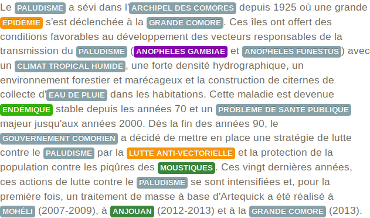
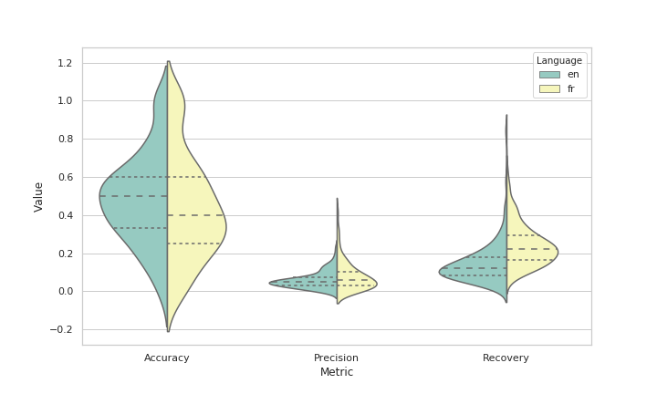
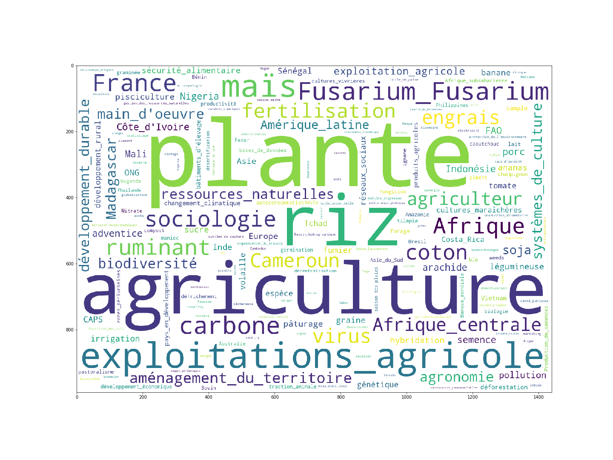

# Indexation automatique de publications

__Fevrier 2020 -- Beye, Qohafa, Neverov__

## Introduction 

Le conservation et le partage des ressources scientifiques issues de la recherche est aujourd'hui encore
une vraie problématique pour les services d'information scientifique et technique (IST). 
En effet l'indexation des publications est faite de manière manuelle alors que les données augmentent jour après jour.
Grâce à L'IA et notamment aux techniques de _traitement naturel du langage_, nous avons mis en place un outil d'indexation automatique de documents scientifiques issues de Agritrop, l'archive ouverte des publications de Cirad. 
Les outils que nous avons mis en place sont [GROBID](https://github.com/kermitt2/grobid) et [entity-fishing](https://github.com/kermitt2/entity-fishing).
Ce sont des logiciels open source qui permettent d'appliquer le machine learning a la recherche d'information dans les publications scientifiques non structurées. 

Dans l'archive ouverte du Cirad, l'indexation s'est faite jusque là à la main. 
La problematique est donc d'extraire des mots clés ainsi que des entités geographiques des publication non structurées (sous format `pdf`).
Le but final de cette démarche est de faciliter la consultation et la recherche documentaire dans l'archive. 

## GROBID

GROBID (GeneRation Of BIbliographic Data) est une librairie de machine learning qui permet de parser des publications scientifiques sous le format `pdf` et de le transformer au format `xml` TEI.
Elle est implémentée en java et met a disposition un service REST. 
Aujourd'hui GROBID est utilise en production dans des grandes archives scientifiques comme HAL et ResearchGate.


## Entity-fishing

Entity-fishing est un outil developpé par les mêmes auteurs que GROBID et sont etroitement liés.
Par exemple entity-fishing necessite GROBID et GROBID-NER (Named Entity Recognition) pour fonctionner.
Cet outil dispose aussi d'une API REST que nous avons utilisé, il dispose de differents modèles pour les principaux languages européens.
Ceux-ci sont entrainés sur Wikipédia et ne sont donc pas tout à fait adaptés au domaine de l'agronomie.

Voici un exemple de sortie dans la [webapp de démonstration](http://cloud.science-miner.com/nerd/):

<p align='center'>
	
</p>

## AGROVOC

Le dernier élément nécessaire pour notre étude technique est le thesarus [AGROVOC](http://aims.fao.org/fr/agrovoc).

C'est un vocabulaire contrôlé couvrant tous les domaines d’intérêt de l'Organisation des Nations Unies pour l'alimentation et l'agriculture (FAO), notamment ceux ayant trait à l'alimentation, la nutrition, l'agriculture, la pêche, la foresterie, l'environnement, etc. 
Il est publié par la FAO et révisé par une communauté d'experts. AGROVOC est utilisé par des chercheurs, des libraires et des gestionnaires d'information pour indexer, extraire et organiser des données dans des systèmes d'information agricole ou des pages web.

Nous allons utiliser AGROVOC pour reconcilier les entités avec les mots clés des publications. 

## Deploiement

Dans cette section nous allons expliquer comment nous avons procédé durant cette étude technique.

Nous avons commencé par installer GROBID sur une machine, cette étape n'etait pas particulierement compliquée mais nous avons dû nous assurer que GROBID possédait toutes les autorisatons d'accès nécessaires.
Nous avons utilisé l'API REST avec une simple requette POST écrite en Python:

```python
import requests

pdf = requests.get('url_du_pdf')  # on récupère le pdf dans l'archive
r = requests.post('http://localhost:8080/api/processFulltextDocument', 
                  files={'input': pdf.content}) # on fait appel a GROBID
r.text # on recupère une string de l'xml TEI
```
Dans l'exemple ci-dessus nous faisons appel au service `processFulltextDocument` qui nous rend l'`xml` contenant toute l'information de l'article.
Il y a d'autres services qui permettent d'extraire que des sous-parties de l'information comme les références ou le header.

Pour entity-fishing nous avons fait une requette très similaire, la seule difficulté etait de d'extraire le texte brut de la publication.
Nous avons utilisé le parseur `lxml` bour accéder au tag `<body>`.
A la sortie d'entity-fishing nous recupérons un `json` avec toutes les entités identifiées.
Ce `json` fournit aussi un lien vers le concept wikipédia, un score de confiance, et le span ou l'entité se trouve dans le texte.
Nous n'avons pas pu exploiter ce score de confiance pour identifier les entités les plus coherentes car il ne representait pas la pertinence des concepts.


## Résultats 

Dans cette section nous allons décrire les résultats que nous avont obtenu pour les publications en français et en anglais. 
Le statistiques presentées dans cette section ont été calculées sur 100 publications car le temps d'execution est relativement élevé (plus ou moins 30 minutes pour les 100).
Nous utilisons trois ensembles pour calculer les metriques: 
 - les _descripteurs_ de la publication (des mots clés issus de AGROVOC identifiés par des documentalistes/indexeurs qui decrivent la publication);
 - les _entités_ (l'ensembles des termes identifiés par entity-fishing);
 - les _entités-agrovoc_ (le sous ensemble des entités reconciliables avec AGROVOC ou encore l'intersection des entités avec AGROVOC).

### En chiffres

Nous avons identifié trois métriques intéressantes dans notre contexte: l'accuracy, la précision et le recouvrement.

L'accuracy c'est le nombre d'élements qui sont des entités-agrovoc et descripteurs en même temps divisé par le nombre de descripteurs. 
La precision c'est le nombre d'entites-agrovoc qui sont aussi des descripteurs divisé par le nombre total d'entités-agrovoc. 
Et enfin le recouvrement c'est le nombre d'entités-agrovoc divisé par le nombre total d'entités.

| Mode | Accuracy | Precision | Recovery | Nombre moyen d'entités |
| ---- | -------: | --------: | -------: | ---------------------: |
| Français - texte complet | 0.440 | 0.083 | 0.243 | 284 |
| Anglais - texte complet | 0.490 | 0.061 | 0.150 | 840 |
| Français - résumé | 0.268 | 0.239 | 0.461 | 24 |

Le violinplot suivant reprend le mêmes chiffres mais montre les distributions:

<p align='center'>
	
</p>

### En images

Nous avons pensé qu'il etait interessant de visualiser les mots qui sont identifiés le plus souvent par entity-fishing.
Le wordcloud qui suit représente la frequence totale sur notre echantillon des entités-agrovoc.

<p align='center'>
	
</p>

## Documentation

Nous avons crée un notebook [`documentation.ipynb`](documentation.ipynb) pour documenter notre code et donner des exemples.

## Conclusion

Nous avons donc mis en place la toolchain nécessaire au traitement des publications. 
A première vue, l'accuracy inférieure à 0.5 ne permettra pas pour l'instant d'appliquer la toolchain en production.
Une des raisons pour lesquelles notre systeme n'est pas performant est le fait que le modèle NER de entity-fishing est entrainé sur Wikipedia, or agrovoc est beaucoup plus sécialisé que wikipedia dans le domaine de l'agronomie.
Une autre raison est que nous essayons de faire de l'extraction de mots clés en utilisant de l'extraction d'entités nommées. 
Ce qui signifie que un mot-clé peut etre très pertinent même s'il n'est pas présent dans le texte. 
Or notre système ne sera pas capable d'identifier de tels mots clés.

## Bibliographie